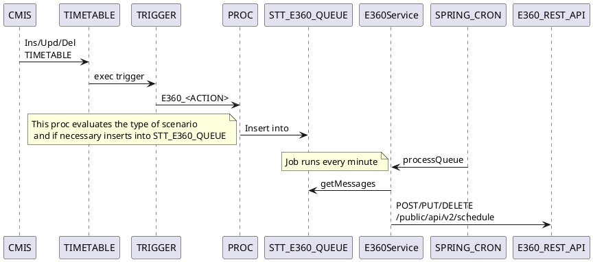
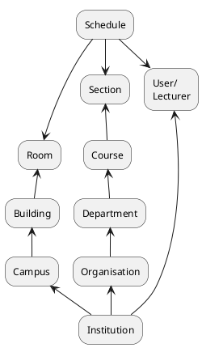

# CMIS Design

## Definitions

// TODO

## Different data model structures

The data models used by CMIS and E360 differ in one very distinct aspect,
namely how they represent classes.
In E360 the main entity is called SCHEDULE and it represents
one class, taking place in a particular room and at a particular date and time.

In CMIS the main entity is called TIMETABLE.
This represents a set of classes taking place in a particular room and
at a particular time and day of the week but across
1 or more weeks.

When publishing CMIS schedule information to E360 a REST API must be used.
Due to the data model structures mentioned above when a change is made to one
row in CMIS, many REST API calls may need to be made to the E360 REST API in order to keep
the schedules in sync.


## Criteria for sending schedule information to E360

When a TIMETABLE entry is inserted or updated, it is only of interest to E360 if it meets the following criteria:
- a row must exist in MODULE with the same (SETID, MODULEID)
- the TIMETABLE column SOURCESID must have value 'TEACH'
- the TIMETABLE column STATUS must have value '2'
- the TIMETABLE column SLOTENTRY must have value '1'
- the TIMETABLE column ROOMID must be non-null
- a row must exist in ROOMREQUESTS with matching (SETID) and FEATUREID must have value 'AUDIOREC' or 'VIDEOREC'.
- a row must exist in ROOMFEATURES with matching (SETID, ROOMID) and FEATUREID must have value 'AUDIOREC' or 'VIDEOREC'.
- a row must exist in MODULEGROUPS with matching (SETID, MODULEID) and the first 2 chars of MODULEGROUPS.GRPCODE must match a row in STT_COMPONENT_TYPE.MODULE_SUBGROUP_CODE
- the MODULEGROUPS.GRPCODE value from above must have a length of 4 and characters 3 and 4 must be digits.

The criteria above is an interpretation of the logic used the SpaceTT code `TestWorkloadExtractService#testProduceEchoExtract`.

## Scenarios

The CMIS analysis identified 8 scenarios that need to be considered when transferring data from CMIS to E360.
These are laid out in the following sub-sections.
In the following sections we assume that previous messages were successfully sent to  E360.
It will be the SpaceTT Dispatcher's responsibility to ensure that messages are sent in the correct order.

### New schedule - meets criteria

The most straight forward scenario is when a new schedule is submitted that meets the criteria
such that it needs to be sent to E360. This requires that a POST request be sent to E360 for each
week associated with the weekId.

### New schedule - doesn't meet criteria

When a new schedule is submitted that does not meet the criteria for it to be sent to E360 then this schedule can
simple be ignored.

### Update schedule - previously did not meet criteria - now meets criteria

When a schedule is updated that previously did not meet the criteria for it to be sent to E360
then treat it as a [New schedule](#New schedule - meets criteria)

### Update schedule - previously did not meet criteria - still does not meet criteria

When a schedule is updated that previously did not meet the criteria for it to be sent to E360
and it still does not meet the criteria then the update can be ignored.

### Update schedule - previously met criteria - still meets criteria - week id not updated

When a schedule previously met the criteria and is updated such that it still meets the criteria
and the weekid value has not been updated then a PUT request must be sent to E360 for each week associated
with the weekId.

### Update schedule - previously met criteria - still meets criteria - week id updated

When a schedule previously met the criteria for sending to E360 and
is then updated, where the update includes a change to the weekid, and still satisfies the
criteria for sending to E360 then a series is insert, update and delete messages
will be sent to E360.

Where the new weekid references weeks that weren't associated with the original schedule then a POST request will be sent for each of these weeks.
Where the new weekid no longer references weeks that were associated with the original schedule then a DELETE request will be sent for each of these weeks.
Where the new weekid references weeks that were also associated with the original schedule then an UPDATE request will be sent for each of these weeks.

### Update schedule - previously met criteria - no longer meets criteria

When a schedule previously met the criteria and is updated such that it no longer meets the criteria
then for each of the weeks associated with the weekid of the schedule before it was updated
a DELETE request must be sent to E360.

### Cancel schedule - previously met criteria

When a schedule previously met the criteria and is cancelled a DELETE request myst be sent to E360.

### Cancel schedule - previously did not meet criteria

When a schedule is cancelled that previously did not meet the criteria for it to be sent to E360
then the cancellation can be ignored.

## Component Interactions


## Triggers
### DB Insert Trigger
A new DB Insert trigger (after each row) will be created on the TIMETABLE table.
This trigger will verify the criteria in
[Criteria for sending schedule information to E360](#Criteria for sending schedule information to E360)
has been met and if so then a new row will be inserted into
[DB Table STT_ECHO_QUEUE](#DB Table STT_ECHO_QUEUE).

### DB Update Trigger
A new DB Update trigger (before each row) will be created on the TIMETABLE table.
This trigger will identify which of the scenarios
specified above this update matches and depending on that scenario may
insert the appropriate values into STT_ECHO_QUEUE.

### DB Delete Trigger
A new DB Delete trigger (before each row) will be created on the TIMETABLE table.
This trigger will insert a new row in STT_ECHO_QUEUE with an action DELETE
if the row that is being deleted or cancelled (status = 3)
meets the [Previous met criteria](#Previous met criteria) test.

### Previoiusly met criteria

The Update and Delete triggers above need to determine whether
the schedule's previous version met the criteria whereby the data needed to be sent
to E360.

The test that will be used to determine if the previous version of this schedule
did meet the criteria requiring it to be sent to E360 is:
- there must exist a row in STT_ECHO_QUEUE matching the schedule's (setid, slotid) that was successfully sent
- the most recent of these rows must have an action of INSERT or UPDATE (not DELETE).


## DB Table STT_ECHO_QUEUE
To support the integration with E360 a new table will be created.

| SOURCE         | NAME          | TYPE          | DESC                                              |
|----------------|---------------|---------------|---------------------------------------------------|
| TIMETABLE      | ID            | NUMBER        | Sequence SEQ_STT_ECHO_QUEUE                       |
|                | CREATED       | DATE          | Date/timestamp when row was inserted              |
|                | PROCESSED     | DATE          | Date/timestamp when row was processed             |
|                | STATUS        | VARCHAR(1)    | [UNPROCESSED\|IN_PROGRESS \| PROCESSED \| FAILED] |
|                | ERROR         | VARCHAR2(100) | A description of the error                        |
| TIMETABLE      | ACTION        | VARCHAR(1)    | The type of request to be sent to E360: [I\|U\|D] |
| TIMETABLE      | SETID         | VARCHAR2(10)  |                                                   |
| TIMETABLE      | SLOTID        | NUMBER        |                                                   |
| TIMETABLE      | WEEKID_OLD    | NUMBER        |                                                   |
| TIMETABLE      | WEEKID_NEW    | NUMBER        |                                                   |
| TIMETABLE      | WEEKDAY       | NUMBER        |                                                   |
| TIMETABLE      | STARTTIME     | VARCHAR2(5)   |                                                   |
| TIMETABLE      | FINISHTIME    | VARCHAR2(5)   |                                                   |
| TIMETABLE      | MODULEID      | VARCHAR2(20)  |                                                   |
| TIMETABLE      | MODGRPCODE    | VARCHAR2(10)  |                                                   |
| TIMETABLE      | ROOMID        | VARCHAR2(16)  |                                                   |
| TIMETABLE      | ROOMGRPCODE   | VARCHAR2(12)  |                                                   |
| TIMETABLE      | LECTURERID    | VARCHAR2(10)  |                                                   |
| STT_EXT_PERSON | BUSINESSEMAIL | VARCHAR2(80)  |                                                   |
| ROOMREQUESTS   | FEATUREID     | VARCHAR2(10)  |                                                   |

NB We don't need the slot entry because it is always 1.

## Spring CRON job

A new application will be created called SpaceTT2.
This application will run on Java21 which is the latest LTS Java version.
This application will be configured to run Spring CRON jobs.
The library to use is the [Quartz Scheduler](https://docs.spring.io/spring-boot/reference/io/quartz.html)
which allows the scheduler to be controlled to run on only one instance using DB tables.
By default the scheduler uses an in-memory DB but this can be altered by modifying a configuration property.

The CRON job will initiate a call to the E360Servce component that will
process messages waiting to be processed on the STT_E360_QUEUE.

## E360Service

The E360Service will read all unprocessed messages from the STT_E360_QUEUE table.
For each row a request will be created and posted to the E360 REST service.

All of the data that needs to be sent to E360 in the Schedule message is contained in the STT_E360_QUEUE table.

Examples of each of the request types are shown below.

### E360 Insert Request

An example of an Echo360 request to notify it of a new timetable entry is shown below:

```json
{
  "startDate": "2024-11-15",
  "startTime": "15:00",
  "endTime": "16:00",
  "sections": [
    {
      "sectionExternalId": "ENGLANG1003_LC01"
    }
  ],
  "name": "Test New Schedule Name",
  "externalId": "617747-1-2023-24",
  "venue": {
    "roomExternalId": "ROOM1"
  },
  "presenter": {
    "userEmail": "David.J.Forrest@glasgow.ac.uk"
  },
  "input1": "Display",
  "input2": "Video",
  "captureQuality": "High"
}
```

TODO where does captureQuality come from?

An example of a response to a successful create event looks as shown below:
```json
{
  "institutionId": "53a8f99c-fb41-4139-9c3c-c471c49f8cf7",
  "id": "43884be2-4906-4bd6-b626-aa0e2f4e2013",
  "name": "Test New Schedule Name",
  "startDate": "2024-11-15",
  "startTime": "15:00",
  "endTime": "16:00",
  "venue": {
    "campusId": "5287b36c-3675-4589-9917-d7173077fbef",
    "campusName": "GILMOREHILL CAMPUS",
    "buildingId": "8479ac03-735f-4982-bdb8-3617978bfd00",
    "buildingName": "Test",
    "roomId": "d73fa127-9cd5-44f9-9cfa-d2445dcafd23",
    "roomName": "Main Meeting Room"
  },
  "presenter": {
    "userId": "14590435-35ff-4650-adf2-796c0e612ad0",
    "userEmail": "David.J.Forrest@glasgow.ac.uk",
    "userFullName": "David Forrest"
  },
  "sections": [
    {
      "courseId": "66567d3e-b575-43cc-ba1a-4f4510bbbb72",
      "courseIdentifier": "ENGLANG1003",
      "termId": "ac00a9be-15f9-4f84-a85e-f9edf50ea38d",
      "termName": "2020/21",
      "sectionId": "8b2437e9-3639-4f9f-9683-c7c869bd187e",
      "sectionName": "LC01"
    }
  ],
  "shouldCaption": false,
  "shouldStreamLive": false,
  "shouldAutoPublish": true,
  "shouldRecurCapture": false,
  "input1": "Display",
  "input2": "Video",
  "captureQuality": "High",
  "externalId": "617747-1-2023-24"
}
```

The full schema for the operation `Add Schedule` is available from the [API documentation](https://echo360.org.uk/api-documentation#!/schedules_v2/Create).

#### Updating

An example of updating the time is shown below.

```json
{
   "startDate": "2024-11-15",
   "startTime": "16:00",
   "endTime": "17:00",
   "sections": [
      {
         "sectionExternalId": "ENGLANG1003_LC01"
      }
   ],
   "name": "Test New Schedule Name",
   "externalId": "617747-1-2023-24",
   "venue": {
     "roomExternalId": "ROOM1"
   },
   "presenter": {
      "userEmail": "David.J.Forrest@glasgow.ac.uk"
   },
   "input1": "Display",
   "input2": "Video",
   "captureQuality": "High"
}
```

The response to an update request is structurally the same as for an insert request.

#### Deleting

An example of a request that can be sent to delete an event is shown below:
```json
delete /public/api/v2/schedules/{schedule}
```
where {schedule} can be an external id or an E360 id. We shall use the external id.

## Error Handling

When an error is received while processing a row within STT_ECHO_QUEUE
then an attempt will be made to recover, e.g. to fix missing reference data,
however if that is not possible then the STT_ECHO_QUEUE.STATUS of that row will be set to `FAILED`
and a description of the error added to STT_ECHO_QUEUE.ERROR column.

A UI will be created to allow administrators to view the messages that have failed
and allow them to retry 1 or more messages.
When the user submits a retry request via the UI then a new row(s) will be inserted into
STT_ECHO_QUEUE and these will be processed when a subsequent CRON job runs.

### Missing reference data

The reference data contained within E360 will be largely complete however we cannot rely upon all
the rooms, lecturers and sections (course + sub-group) and their parent entities being known to E360.



When a request to insert or update the schedule data in E360 fails because an entity
the schedule depends on is missing then SpaceTT2 will identify the type of
entity that is missing from the error response, insert the missing entity and any missing parent entities,
and then attempt to insert or update the schedule data again.

The approach may result in repeated attempts to insert or update the same schedule, for example,
when the room, lecturer and course information are all missing from E360.

#### Identifying missing reference data type

When E360 is unable to identify a particular entity specified in a schedule request then it will
return an error code of `400` and a JSON response document containing `RoomNotFound`, `UserNotFound` or
`ScheduleNotFound` respectively. An example response document for the room not found scenario
would be:
```json
{
  "error": "RoomNotFound",
  "message": "Room not found"
}
```

The parents of the Room and Section entities are shown in the diagram above.

NB Users/Lecturers cannot be created via the REST API and therefore will require manual intervention.

### External Id not unique
If an insert request is made but the external id is already known to Echo360 then we can assume that this request is
being retried and therefore if it fails on this occasion then we can assume it was successful previously and we can ignore the error.

### Venue / Time slot is already taken
When an insert or update request receives a `Schedule timing clash with another Schedule` error then record this error in
`STT_ECHO_QUEUE.ERROR` and do not resend until the issue has been resolved manually.

### Other errors
When any other errors occur note them in `STT_ECHO_QUEUE.ERROR`
and await manual intervention before retrying.

## User Interface

A user interface will be available to allow administrators to view the number of schedules that have been
transferred in the last 24 hours and the number (if any) that are pending transfer.

Administrators will also be able to see the schedules that failed to transfer
and re-trigger the sending of the schedule change.

## Tasks to integrate CMIS with ECHO360

- Setup Wildfly server running Java 21 in the TEST and LIVE environments
- Create a template project running Java 21
- Create the table STT_ECHO_QUEUE.
- Create Stored Procedures to write to STT_ECHO_QUEUE.
- Create the new DB triggers on the TIMETABLE table.
- Add new CRON job to process files to E360
- Add E360Service method to read messages from STT_ECHO_QUEUE
- Add E360Service method to send messages to E360 REST API
- Add error handling code for when the following entities are missing:
    - Room, Building
    - Section, Course, Department, Organisation
- Add UI page to allow administrators to view messages that failed with their error messages.
- Add UI page to allow administrators to retry one or more messages to be retried
- Add UI page to allow administrators to pause the sending of messages to E360


====


The design to transfer data from CMIS to SpaceTT should follow a standard Extract, Transform and Load (ETL) pattern.

There is a significant difference in the way that data is held in CMIS vs how it is held in Echo360 (and SpaceTT).
In Echo360 its main schedule entity represents 1 class that takes place at a certain time and place with a specified lecturer.

In CMIS the main entity is the `TIMETABLE` table which represents a set of classes
that take place at the same time-of-day and place and with the same lecturer but the row signifies
the classes taking place across a set of weeks.

To understand the issue that this causes lets examine the situation where a CMIS slot initially has
a class that takes place on weeks 4 and 5. When this row is migrated to Echo360 two requests to insert
schedules in Echo360 will be made with the external ids (<slot_id>_<weekno>_<setid>) 2222_4_2024 and 2222_5_2024.

When an edit is made to CMIS to change the weeks to 5 and 6, the INSERT and DELETE triggers fire.
resulting in the 2 corresponding rows being added to `STT_EVENT_ACTION`.

To keep Echo360 in sync 3 requests will need to be sent:

| EXTERNAL_ID | ACTION |
|-------------|--------|
| 2222_4_2024 | DELETE |
| 2222_5_2024 | UPDATE |
| 2222_6_2024 | INSERT |

The update request will need to be sent so that if any of the other fields were updated at the same time
then they will also be synced with Echo360.

In order to know that a DELETE request needs to be sent for EXTERNAL_ID the weekid needs to be added to
the `STT_EVENT_ACTION`, otherwise when the integration process comes to these rows it won't know
which weeks to send a DELETE request for because the row will already have been deleted from the table.

When processing the entries in this table the these 2 entries, the delete and insert
will need to be interpreted as one action so that the request sent are (delete, update, insert)
rather than (delete, delete, insert, insert).

The process will be initiated on the same schedule as that described in the
section [integration from cmis to spacett](#integration from cmis to spacett), i.e. every minute.

In the absence of jms infrastructure the `stt_event_action` table will also be used to control which timetable records are processed.
this table will have two additional varchar columns added called `echo360_processed` and `echo360_error_message`.
the existing column `processed_flag` will be renamed to `spacett_processed` to make its purpose more explicit.
the echo360 records to process will be identified by those rows where the `echo360_processed` value is `unprocessed`
and the `spacett_processed` value is `processed`. allowing the spacett processing to complete first
will hopefully avoid any contention to update the same row by two different processes.

To cope with error scenarios an additional column will be added `echo360_error_message`.
when an error occurs while processing a message to echo360, the `echo360_processed` value will be set to `f`
and `echo360_error_message` columns will be populated with an appropriate error message.
these rows will not be re-attempted until the `echo360_processed` and `echo360_error_message` values are cleared
which is described in the section [recovering from echo360 error](#recovering from echo360 error)
subsequent rows with the same primary key will also not be processed.

### selection criteria

The selection criteria used to identify data to transfer to echo360 will follow the logic
currently used by the [cmis batch](#cmis batch).

First get a list of the classes (modules) that we are interested in sending to echo360.
do this by joining `module` to `timetable` and select where the `slotentry` is `1`,
the `status` is `2` and `sourcesid` is `teach`. the associated roomid must also have a `featureid` of `audiorec`
or `videorec`.

Then get the extract items with associated moduleid, grpcode, component and grpsize.

Produce the echo schedules by filtering `timetable` rows by `slotentry` is `1`,
the `status` is `2` and `sourcesid` is `teach`. the associated roomid must also have a `featureid` of `audiorec`
or `videorec`.

### loading the data changes to echo360

#### inserting

An example of an Echo360 request to notify it of a new timetable entry is shown below:

```json
{
  "startDate": "2024-11-15",
  "startTime": "15:00",
  "endTime": "16:00",
  "sections": [
    {
      "sectionExternalId": "ENGLANG1003_LC01"
    }
  ],
  "name": "Test New Schedule Name",
  "externalId": "617747-1-2023-24",
  "venue": {
    "roomExternalId": "ROOM1"
  },
  "presenter": {
    "userEmail": "David.J.Forrest@glasgow.ac.uk"
  },
  "input1": "Display",
  "input2": "Video",
  "captureQuality": "High"
}
```

An example of a response to a successful create event looks as shown below:
```json
{
  "institutionId": "53a8f99c-fb41-4139-9c3c-c471c49f8cf7",
  "id": "43884be2-4906-4bd6-b626-aa0e2f4e2013",
  "name": "Test New Schedule Name",
  "startDate": "2024-11-15",
  "startTime": "15:00",
  "endTime": "16:00",
  "venue": {
    "campusId": "5287b36c-3675-4589-9917-d7173077fbef",
    "campusName": "GILMOREHILL CAMPUS",
    "buildingId": "8479ac03-735f-4982-bdb8-3617978bfd00",
    "buildingName": "Test",
    "roomId": "d73fa127-9cd5-44f9-9cfa-d2445dcafd23",
    "roomName": "Main Meeting Room"
  },
  "presenter": {
    "userId": "14590435-35ff-4650-adf2-796c0e612ad0",
    "userEmail": "David.J.Forrest@glasgow.ac.uk",
    "userFullName": "David Forrest"
  },
  "sections": [
    {
      "courseId": "66567d3e-b575-43cc-ba1a-4f4510bbbb72",
      "courseIdentifier": "ENGLANG1003",
      "termId": "ac00a9be-15f9-4f84-a85e-f9edf50ea38d",
      "termName": "2020/21",
      "sectionId": "8b2437e9-3639-4f9f-9683-c7c869bd187e",
      "sectionName": "LC01"
    }
  ],
  "shouldCaption": false,
  "shouldStreamLive": false,
  "shouldAutoPublish": true,
  "shouldRecurCapture": false,
  "input1": "Display",
  "input2": "Video",
  "captureQuality": "High",
  "externalId": "617747-1-2023-24"
}
```

The full schema for the operation `Add Schedule` is available from the [API documentation](https://echo360.org.uk/api-documentation#!/schedules_v2/Create).

#### Updating

An example of updating the time is shown below.

```json
{
   "startDate": "2024-11-15",
   "startTime": "16:00",
   "endTime": "17:00",
   "sections": [
      {
         "sectionExternalId": "ENGLANG1003_LC01"
      }
   ],
   "name": "Test New Schedule Name",
   "externalId": "617747-1-2023-24",
   "venue": {
     "roomExternalId": "ROOM1"
   },
   "presenter": {
      "userEmail": "David.J.Forrest@glasgow.ac.uk"
   },
   "input1": "Display",
   "input2": "Video",
   "captureQuality": "High"
}
```

The response to an update request is structurally the same as for a create request.

#### Deleting

An example of a request that can be sent to delete an event is shown below:
```
delete /public/api/v2/schedules/{schedule}
```
where {schedule} can be the external id.

### Extracting and transform CMIS data

#### How does SpaceTT deal with updates to `WEEKID` or `WEEKDAY`?

#### How do we deal with changes to data items in the filtering criteria?

i.e. `SLOTENTRY`, `STATUS`, `SOURCESID`, `ROOMID`, `FEATUREID`.

One possibility is to record all rows sent to Echo360 so that we can determine
whether or not an update or delete request needs to be sent.

### Reference data not in Echo 360 (NOT MVP)

Prior to any schedules being transferred to Echo360, all of the reference data associated with:
- rooms
- buildings
- campuses
- lecturers
- sections
- courses
- departments
- organisations

will be retrieved from Echo360 and cached.
Checks will be made using this cached data to ensure that Echo360 contains the necessary reference data
prior to an insert or update request being made.

#### Start and end times
The start and end, date and times can be read from the `STT_TIMETABLE` columns: `STARTDATE` and `FINISHDATE`.

#### Rooms, Buildings and Campuses
It is proposed that when communicating the room to Echo360, the externalId attribute is used.
This value can be sourced from `TIMETABLE.ROOMID`.
The room definition within Echo360 contains a reference to a Building, which contains
a reference to a Campus so there is no need to specify the Building or Campus
within a create/update schedule request.

In theory all the CMIS room/building/campus data should be in sync with Echo360.
In integration testing we can evaluate the prevalence of missing data in Echo360
and enhance this solution to populate the data automatically when it is missing if necessary.

#### Lecturers

In the CSV file generated at the start of the year, the lecturer value used is the Echo360 user id.
This value is sourced from the table 'STT_ECHO_USER' after the id of the first lecturer or contact is identified.
So that we don't need to maintain this table it is proposed that in our requests we use the user/contact's email
address which is available from `STT_EXT_PERSON.BUSINESSEMAIL`.

#### Sub-group, course, department and organisation

| Name         | Source                          |
|--------------|---------------------------------|
| sub-group    | TIMETABLE.MODGRPCODE            |
| course       | TIMETABLE.MODULEID              |
| department   | TIMETABLE.DEPTID                |
| organisation | first 3 chars of dept + 5 '0's? |

NB the retrieval method for `course` is more complex in the Echo360 code. See `<sql-query name="getSttSections">`.

### Transforming the data

### Error handling


---


The records that will be processed

The columns (SETID, SLOTID, SLOTENTRY) are a composite primary key on the TIMETABLE table and therefore should be used as the EXTERNAL_ID when communicating schedule events to Echo360.

It is proposed that instead of this batch approach we queue changes to the schedule in CMIS for transfer to Echo360 within one minute.
When CMIS is rolled-over we estimate that this could result in 185,000 being queued for transfer which could take a day to fully transfer to Echo360.

An event table already exists within CMIS to facilitate the transfer of schedule changes to SpaceTT.
It is proposed that this approach is extended to support the integration to Echo360.
JMS would be a natural architectural component to support this type of integration however additional time would be required to setup a JMS server.


External ID
- Setid_slotid_slotentry_weeknumber


The following actions may not cause an entry to be written to `STT_EVENT_ACTION`:
- What happens when the feature v/r is added/removed.
- Lecturer adds/removes approval


## Extraction
To identify the data that needs to be extracted from CMIS a combination of examining the current batch process to see what data it extracts with reviewing the data that needs to
be submitted to the


The current process extracts all timetable records for the year however the new implementation should process records as they appear in the table `stt_event_action`.
The current process extracts the data using many different SQL calls.

These should be analysed and refactored/implemented in a Java21 compliant project.

An example of a few of the rows from the CSV file that was extracted from CMIS is shown below:

| Start Date | Start Time | End Date | Days Of Week | Exclusion Dates | Duration Minutes | Term Id                              | Name         | Room Id                              | Sections                                      | Instructor Id | Guest Instructor                     | Should Caption | Should Stream Live | Input1 | Input2  | Capture Quality | Stream Quality | External Id |
|------------|------------|----------|--------------|-----------------|------------------|--------------------------------------|--------------|--------------------------------------|-----------------------------------------------|---------------|--------------------------------------|----------------|--------------------|--------|---------|-----------------|----------------|-------------|
| 14/01/2025 | 13:00      |          |              |                 | 60               | a2cbad7b-a9d1-4c3c-ad72-df7f71c062a0 | CC1B Lecture | 0a2140d3-1258-413c-949d-9dd6d753d463 | 008539bf-c2db-470c-841d-7ba85bc5a92c=relative | 1             | 30dd631a-7b24-4d7b-aa21-70cfbf901955 |                | FALSE              | FALSE  | Display | Video           | Medium         | 4301_22_2024|
| 21/01/2025 | 13:00      |          |              |                 | 60               | a2cbad7b-a9d1-4c3c-ad72-df7f71c062a0 | CC1B Lecture | 0a2140d3-1258-413c-949d-9dd6d753d463 | 008539bf-c2db-470c-841d-7ba85bc5a92c=relative | 1             | 30dd631a-7b24-4d7b-aa21-70cfbf901955 |                | FALSE              | FALSE  | Display | Video           | Medium         | 4301_23_2024|
| 25/03/2025 | 13:00      |          |              |                 | 60               | a2cbad7b-a9d1-4c3c-ad72-df7f71c062a0 | CC1B Lecture | 0a2140d3-1258-413c-949d-9dd6d753d463 | 008539bf-c2db-470c-841d-7ba85bc5a92c=relative | 1             | 30dd631a-7b24-4d7b-aa21-70cfbf901955 |                | FALSE              | FALSE  | Display | Video           | Medium         | 4301_32_2024|
| 13/01/2025 | 13:00      |          |              |                 | 60               | a2cbad7b-a9d1-4c3c-ad72-df7f71c062a0 | CC1B Lecture | 0a2140d3-1258-413c-949d-9dd6d753d463 | 008539bf-c2db-470c-841d-7ba85bc5a92c=relative | 1             | 695b080c-6bcf-4c72-b0c3-7671a739ff9f |                | FALSE              | FALSE  | Display | Video           | Medium         | 690452_22_2024|


## Transform
The transformation will not be the same as the current process because that transforms to a CSV file.
A rough description of the transformations for 5 of the key elements is shown in Table 1.
The new transformation will need to map (presumably) the same data to the Echo360 REST interface.

| CMIS                             | EchoSchedule                      | Echo360      | Notes                                                                                                                                               |
|----------------------------------|-----------------------------------|--------------|-----------------------------------------------------------------------------------------------------------------------------------------------------|
| stt_echo_term.echo_term_id       | echoTermId                        | terms        |                                                                                                                                                     |
| stt_echo_room.echo_room_id       | echoRoomId                        | rooms        | handle split rooms as per WorkloadExtractService#produceEchoSchedules. From timetable.roomid => timetable.roomgrpcode => stt_echo_room.echo_room_id |
| stt_echo_section.echo_section_id | echoSections+AvailabilitySections | sections     | lookup by <module_id> + <grp_code> + <year>                                                                                                         |
| stt_echo_user.echo_user_id       | echoInstructorEchoId              | instructors  | lookup based on timetable.lecturerid or slotdetails.contact                                                                                         |
| timetable.slot_id                | eventId + weekNumber + year       | external_ids |                                                                                                                                                     |

**Table 1:** Transformation from CMIS to Echo360 CSV file

## Load
Calling the Echo360 REST interface should be relatively straightforward except that we will need to handle
a number of error scenarios, e.g. where the identifiers for terms/rooms/sections?/instructors/external_ids don't match the data that is currently configured within Echo360.


## Prerequisites

Wildfly instance running Java 21.
Echo360 instance we can use for DEV/TEST.
GitHub repository for the new project.
Jenkins jobs to build the project and deploy to the Test/Live environments.
SMTT/Echo360 users available to verify the integration.

## Tasks

Scenario: Schedule class and integrate with Echo360
Given I am a Central Timetabler
And in CMIS, class C1 is currently unroomed and requires video recording
And Echo360 is not aware of class C1
And Echo306 knows lecturer L
And Echo306 knows class C1's course C
And Echo306 knows about course C's Organisation Structure
And Echo306 knows about room R
When I schedule the class C1, with lecturer L, in room R that has video equipment
Then the schedule for this new class should be sent to Echo360


2.

## Notes

The `Echo360` project in Subversion just has some code to invoke the REST API.
This project makes use of 6 tables:

| TABLE_NAME             | NOTES                                                                                                                      |
|------------------------|----------------------------------------------------------------------------------------------------------------------------|
| STT_ECHO_SCHED_CMIS    | Populated by [SPACETT]EchoExtractService#produceEchoScheduleExtract() but nothing invokes                                  |
| STT_ECHO_SCHED_ECHO    | Not referenced in SPACETT. Insert/Updated in UploadService#insert/updateSchedule() when event successfully sent to Echo360 |
| STT_ECHO_SCHED_HISTORY | After comparing the 2 tables above, writes the messages that will be sent to Echo360 to this table                         |
| STT_ECHO_USER          |                                                                                                                            |
| STT_ECHO_COURSE        |                                                                                                                            |
| STT_ECHO_SECTION       |                                                                                                                            |


- create a new Wildfly instance running Java 21.
- migrate the existing code that updates the SpaceTT tables from the CMIS tables.
- extend the code that triggers the updates to SpaceTT so that it will also initiate the transfer to Echo360
- refactor the code currently in CMIS that generates the CSV files
    - this code is initiated from `mis.spacett.service.TestWorkloadExtractService#testProduceEchoExtract`
    - it ultimately generates CSV files as shown here: https://gla.sharepoint.com/:f:/s/Echo360CMISIntegration/EsdLT8nBFN9CpV1dXtsvDX0BxiRxHR72Fg0Vgn_lkxL8tw?e=xb99qT
    - the columns in this file are:
        - Start Date
          Start Time
          End Date
          Days Of Week
          Exclusion Dates
          Duration Minutes
          Term Id
          Name
          Room Id
          Sections
          Instructor Id
          Guest Instructor
          Should Caption
          Should Stream Live
          Input1
          Input2
          Capture Quality
          Stream Quality
          External Id
    - identify from the [Echo360 documentation](https://echo360.org.uk/api-documentation) the fields that need to be supplied to communicate a change
```json
[
  {
    "institutionId": "string",
    "id": "string",
    "name": "string",
    "startDate": "2017-02-01",
    "startTime": "09:00",
    "endTime": "10:00",
    "endDate": "2017-05-31",
    "daysOfWeek": [
      "string"
    ],
    "exclusionDates": [
      "string"
    ],
    "venue": {
      "campusId": "string",
      "campusName": "string",
      "buildingId": "string",
      "buildingName": "string",
      "roomId": "string",
      "roomName": "string"
    },
    "presenter": {
      "userId": "string",
      "userEmail": "string",
      "userFullName": "string"
    },
    "guestPresenter": "string",
    "sections": [
      {
        "courseId": "string",
        "courseIdentifier": "string",
        "termId": "string",
        "termName": "string",
        "sectionId": "string",
        "sectionName": "string",
        "availability": {
          "availability": "string",
          "relativeDelay": 0,
          "concreteTime": "2024-10-29",
          "unavailabilityDelay": 0
        }
      }
    ],
    "shouldCaption": true,
    "shouldStreamLive": true,
    "shouldAutoPublish": true,
    "shouldRecurCapture": true,
    "input1": "string",
    "input2": "string",
    "captureQuality": "string",
    "streamQuality": "string",
    "externalId": "string"
  }
]
```


## Echo360 [CTS-204](https://uofglasgow.atlassian.net/browse/CTS-204)

## CMIS Integration with SpaceTT

Timetable events are maintained within the `TIMETABLE` table within the CMIS DB.
When a DML statement is executed on the `TIMETABLE` table an INSERT/UPDATE/DELETE trigger fires and inserts a row
into the table `STT_EVENT_ACTION`, using the stored procedure `proc_stt_event_action`.
```sql
create or replace procedure proc_stt_event_action (
  setid_in           in   varchar2,
  slotid_in         in     number,
  slotentry_in      in     number,
  slot_action_in    in     varchar2) is
BEGIN
	insert into stt_event_action(
	          setid,
	          action_eventid	,
              slotid	,
              slotentry,
              slot_action   ,
              processed_flg  ,
              date_created
                         )
                      values
                        (
                         setid_in,
                         stt_event_action_seq.nextval,
                         slotid_in,
                         slotentry_in,
                         slot_action_in,
                         'U',
                         SYSTIMESTAMP);

 END
```

What populates the STT_TIMETABLE table when the STT_EVENT_ACTION row is processed?
SpaceTT has CRON job configured to run the method `mis.spacett.service.ScheduleService#processTimetableEvents` at
"Every minute, between 05:00 AM and 11:59 PM" `0 */1 5-23 * * *`.
This process
```sql
CREATE OR REPLACE FORCE EDITIONABLE VIEW "CMISMGR"."V_STT_IN_PROGRESS_BOOKING" ("SLOTID", "SETID") AS 
  select  sd.slotid as slotid,
        sd.setid as setid
from    timetable t, 
        slotdetails sd
where   t.setid = sd.setid
and     t.slotid = sd.slotid
and     t.userchange like 'facility%'
and     sd.slotline = 0
and     sd.sourcesid is null;

select  action_eventid as eventActionId
from    (
            select  rownum as rn, action_eventid, slot_action
            from    (
                        select  action_eventid, slot_action, date_created
                        from    stt_event_action
                        where   processed_flg = 'U'
                          and     setid= :setId
                          and     slotid not in (select slotid from v_stt_in_progress_booking where setid = :setId)
                        order   by date_created
                    ) unprocessed
        ) batch
where   (rn = :batchSize and slot_action != 'D')
   or      rn < :batchSize
```
This sql retrieves 75 rows of unprocessed rows from stt_event_action table.
The status of these rows is then set to IN_PROGRESS.
The IN_PROGRESS rows are then retrieved.

Scenarios that need to be addressed.
- re-sync CMIS data to Echo360
    - should this be done for all records in one year, just those in the future, something else?
- propagate updates in CMIS data to Echo360

## How was the synchronization done this year

Use the method `mis.spacett.service.EchoExtractService#produceEchoSchedules` as a reference for the information that needs to be extracted from CMIS and passed to Echo360.


Anna asked me to create some files by running the process;

mis.spacett.service.TestWorkloadExtractService#testProduceEchoExtract
mis.spacett.service.WorkloadExtractService#produceEchoScheduleExtract
mis.spacett.service.WorkloadExtractService#writeEchoScheduleFile

The process begins by running the following SQL:
```json
  select distinct m.moduleid as moduleId
  from  module m,timetable t
    where  m.setid= :setId
    and t.slotentry=1 
    and m.owner like '1%'
    and t.setid=m.setid and t.moduleid=m.moduleid and t.sourcesid='TEACH' and t.status =2
   and exists
      (select * from roomrequests r where r.setid=t.setid and  r.featureid='AUDIOREC')
   AND EXISTS
      (SELECT * FROM roomfeatures f WHERE f.setid=t.setid AND f.roomid= t.roomid AND   f.featureid='AUDIOREC' )
```
The digit in the owner clause needed to be updated to reflect the particuar college data that was
being extracted e.g. 1 - Arts, 2 - MVLS, ..., 9 - University Services.
The clauses featuring the `featureid` also had to be modified for each run switching between `AUDIOREC` and `VIDEOREC`.

For each module that is extracted the following SQL is run:
```sql
 	select	g.moduleid as moduleId, 	
 			g.grpcode as grpCode,
			c.component_type_code as component,
			g.csize as grpSize
	from 	modulegroups g
	full outer join stt_component_type c on substr(g.grpcode,1,2) = c.module_subgroup_code
	where 	g.setid= :setId
	and     g.moduleid = :moduleId
```


mis.spacett.service.TestEchoExtractService#testProduceEchoExtract
- gets the string identifying the NEXT_DATASET i.e. 2024-25
- produceClassExtractFileForEcho
    - getCourseForExtractForEchoExtract
        - calls SQL getCourseForExtractForEchoExtract2 with the NEXT_DATASET param and returns 662 rows
```sql
  select distinct m.moduleid as moduleId
  from   module m
  where  m.setid= :setId
  and   (owner  like '401%') 
``` 
        - returns a list of ClassExtract objects but only the moduleId attribute is populated. termCode and moduleName will be null. ouCode, items and status are other fields in this class.
      - getModuleSubgroupByModuleId
```sql
  select  grpcode as moduleGroupId
  from    modulegroups
  where   setid = :setId
  and moduleid  = :moduleId
```
    - if a module sub group exists
        - 
```sql
 	select	g.moduleid as moduleId, 	
 			g.grpcode as grpCode,
			c.component_type_code as component,
			g.csize as grpSize
	from 	modulegroups g
	full outer join stt_component_type c on substr(g.grpcode,1,2) = c.module_subgroup_code
	where 	g.setid= :setId
	and     g.moduleid = :moduleId
```
getTimetableTeachingEventsForEchoExtract
```sql
   select distinct
   t.slotid          as slotId,
   t.slotentry       as slotEntry,
   t.slottotal       as slotTotal,
   t.setid           as setId,
   t.status          as statusInt,
   t.weekday         as weekDay,
   t.starttime       as startTime,
   t.finishtime      as finishTime,
   t.duration        as duration,
   t.weekid          as weekId,
   w.weeks           as weekString,
   t.lecturerid      as lecturerId,
   t.moduleid        as moduleId,
   t.modgrpcode      as modGrpCode
  from    
          timetable t,
          weekmapstring  w
  where   t.setid =:setId
  and     t.sourcesid='TEACH' 
  and     t.status=2 
  and     t.slotentry =1
  and     t.roomid is  not null
  and     t.moduleid=:moduleId
  and     t.modgrpcode=:modGroupCode
  and     t.weekid = w.weekid (+)
  and     (w.setid = :setId  or w.setid is null)
  and exists
  (select * from roomrequests r
  where r.setid=t.setid
  and r.slotid=t.slotid
  and (r.featureid='AUDIOREC' or r.featureid='VIDEOREC'))
  and exists
  (select *
  from  roomfeatures f
  where f.roomid=t.roomid
  and (f.featureid='AUDIOREC' or f.featureid='VIDEOREC') 
  and f.setid=t.setid)
  order by t.slotid, t.slotentry 
```
The above sql returns SLOTS.
For each slot:
1. get the lecturers
2. get the event details
3. resolve the week-string to weeks
4. get the roomid for the slot
5. get the roomgrpcode
6. get the capacity from the rooms table
7. populate the MeetingExtractItem and EchoScheduleItem objects
```
  select distinct descrip  as details 
  from  v_stt_slotdetails
  where setid =:setId
  and slotid = :slotId
```


## Access

### Web

Test server: https://fdtest.spa.gla.ac.uk/spacett/web/home.jsf
Live server: via Staff Portal

### DB

See SqlDeveloper

### CMIS Client

RDP link
- then login in with email/password
- within CMIS app select live/test environment then login again with credentials from BitWarden

### CMIS FUNCTIONALITY

#### Physical
- campuses
- buildings
- rooms
- room pools
- equipment/features
- room features/equipment
- moveable equipment
- travel

#### Academic
- departments
- courses
- instances
- plans
- plan parts
- plan structures
- plan part structure
- class groups
- sub group equivalence
- change sub group code

#### Lecturers


#### Students


#### Miscellaneous


Notes

users
- create classes: school timetablers
- smtt

teaching/non-teaching
non-teaching: lib book
unibus - graduation
reqtype: loc/ctt


datasets: 2024/25


tables timetable/slotid
slotdetails
audittrail
stt_booking_set - links stt booked events to cmis booking events


event_action
copies values to stt_timetable


stt_campus_class


inputs
mycampus
every morning read data from mycampus/quemus/hr external tables

outputs
to mycampus


Outbound data from MyCampus

stt_echo_course
- permission to be recorded


SMTT

J:\DevandIntegration\BusinessSystems\Timetabling\Support\ECHO_360
J Drive is \\campus.gla.ac.uk

[Echo360 API](https://echo360.org.uk/api-documentation#!/schedules_v2/List)
- create an access token and then copy it to the `access token` textbox in the top right of the page.


an entry is made into the table `STT_EVENT_ACTION`.
When CMIS is rolled over this can generate 185,000 entries in the `STT_EVENT_ACTION` table in just one day.
The Echo360 project has an API rate limiter limiting calls to ~120/min, meaning that it could take one day to clear the backlog.

The java process is run 10 times to cover the different combinations of the 5 owners of events
(the 4 colleges plus University Services) and 2 recording options (Audio/Video).
The configured process extracts the data from the CMIS DB's TIMETABLE table and various other child tables.

It is proposed that instead of this batch approach we trigger the transfer of events to Echo360 when an entry is made into the table `STT_EVENT_ACTION`.