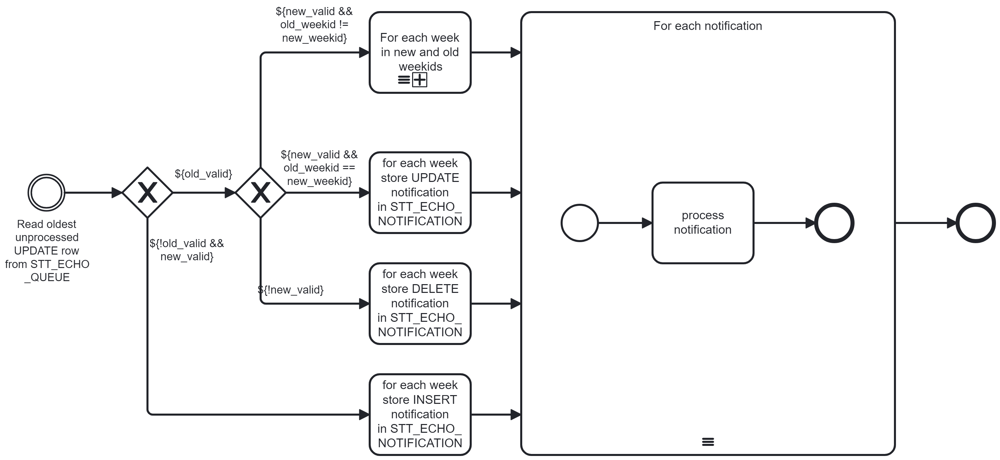
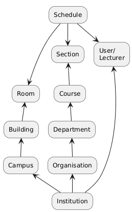

# CMIS Design

## Definitions

Lesson
: An event where a specified lecturer presents part of a course in a particular room at certain date and time.

E360
: The GU Echo360 server that captures and makes available video and audio recordings.

SpaceTT2
: A new component that may be implemented by GU IT department to automate the integration between CMIS and Echo360.

## TODO
1. verify that where a timetable entry with entryslot <> 1 that it will not have an impact on integration
2. could we update every minute in the expectation that few clashes will occur and repair clashes over-night with batch?
3. when will E360 report a clash? 

## Introduction

The purpose of this document is to describe a design to support the 
integration of Glasgow University's Timetabling system (CMIS) and their
audio and visual lesson recording system Echo360 (E360).

The integration will be one way, from CMIS to e360, 
and will include passing all timetable information for lessons that 
require video or audio recording and supporting information such as 
lecturer, course and room details. Where E360 is not aware of
supporting details, these details will submitted to E360 before
submitting the timetable information.

The integration is complicated by the systems holding the data in different data structures and applying different constraints to determine what is valid data.

### Different constraints
The first challenge to integrating the 2 systems is that 
while the timetable is being developed within CMIS it is possible for it to be in an "invalid" state, such that it may record that 2 different lessons will be taught at the same time, in the same room by different lecturers and for different courses.

In contrast E360 has constraints that will not allow the timetable it holds to be in an "invalid" state. If an event is scheduled within E360 to be in a room at a certain date and time and it is notified of another event taking place at the same date and time then it will reject the second notification. For the second notification to be accepted the original event must be updated to be in a different time or place or be deleted.

### Different data model structures
The second challenge to integrating the 2 systems is that the main table within the CMIS 
system has one row represent a lesson 1 **or more weeks**.

In contrast, the main table within the E360 system has one row represent a lesson strictly on 1 week rather than on a set of weeks.

The impact of this is that one change within CMIS can result in multiple changes to E360 and due to the [different constraints](#Different constraints) some of these updates may be successful while others could fail.


## Integration Workflow
The integration from CMIS to E360 will be event driven.
The events will be initiated by insert, update and delete triggers that will be applied to CMIS's TIMETABLE table.
These triggers will result in a row being written to the table STT_ECHO_QUEUE when the data supplied to the trigger meets certain criteria as defined in [Criteria for sending schedule information to E360](#Criteria for sending schedule information to E360).
The work performed in the triggers will be kept to a minimum so as not to impact the
performance of CMIS generally.

A Springframework CRON process running in a new component SpaceTT2, will then read and process each of these rows in the order that they were written.

### Criteria for sending schedule information to E360

When a TIMETABLE entry is inserted, updated or deleted, it is only of interest to E360 if it meets the following criteria:
- the TIMETABLE column SOURCESID must have value 'TEACH'
- the TIMETABLE column STATUS must have value '2'
- the TIMETABLE column SLOTENTRY must have value '1'
- the TIMETABLE column ROOMID must be non-null
- a row must exist in MODULE table with the same (SETID, MODULEID)
- a row must exist in MODULEGROUPS with matching (SETID, MODULEID) and the first 2 chars of MODULEGROUPS.GRPCODE must match a row in STT_COMPONENT_TYPE.MODULE_SUBGROUP_CODE
- the MODULEGROUPS.GRPCODE value from above must have a length of 4 and characters 3 and 4 must be digits.
- a row must exist in ROOMREQUESTS with matching (SETID) and FEATUREID must have value 'AUDIOREC' or 'VIDEOREC'.
- a row must exist in ROOMFEATURES with matching (SETID, ROOMID) and FEATUREID must have value 'AUDIOREC' or 'VIDEOREC'.

<details>
<summary>Developer Note</summary>
The criteria above is an interpretation of the logic used the SpaceTT code `TestWorkloadExtractService#testProduceEchoExtract`.
</details>

### On Insert
When the insert trigger on the TIMETABLE table is triggered the first thing it will do is assess whether the row meets the criteria described above to allow it to be sent to E360.
If it does not meet the criteria then no further processing on it will take place within this trigger.

If it is valid then for each week associated with the CMIS row a sub-process will be initiated to propagate the insert for that week.
Each update sent to E360 relies upon E360 being aware of the associated reference data, e.g. the course, room and lecturer data, and if E360 is not aware of this data then the request will fail. The failure message will indicate which piece of reference data is missing and the process will update E360 with this reference data before re-sending the initial request.

In the event that E360 already has a lesson scheduled for a particular room and date/time, E360 will respond with the error `Venue / Time slot is already taken`. 
An attempt will now be made to refresh all scheduled events on this particular day in the room that has the clash.
If a conflict still exists then a row will then be inserted into the STT_ECHO_DAY_ROOM_CONFLICT table.
When subsequent notifications are received for this room/day then a further full Room/Day refresh will take place, until the scheduling conflict is resolved.


### On Update

When the update trigger on the TIMETABLE table is triggered it has access to the new and old versions of the row.
It accesses whether or not the old and or the new versions of the row meet the criteria to allow it to be sent to E360.
If both the old and the new versions do not meet the criteria then no further processing on it will take place within this trigger, otherwise the details of the update will be inserted into the table `STT_ECHO_QUEUE`.

The details will then be read by a java process which will firstly determine what combination of 
insert, update and delete notifications need to be sent to E360 to synchronize it with the data in CMIS.
These notifications will then be persisted to the table STT_ECHO_NOTIFICATION.

In the most common scenario the corresponding POST, PUT, DELETE requests will be sent to E360 successfully.
As mentioned in the On Insert scenario, an error could occur where reference data is missing and 
this will be rectified by supplying E360 with the reference data and then retrying the request. 

In the scenario where E360 responds with a `Venue / Time slot is already taken` error
then the process will attempt refresh the data in E360 with the latest data in CMIS for 
a particular room and day.

Where a different error is received then user intervention will be required to resolve
the issue. A list of the notifications that failed will
be displayed on the admin screen. 
When Administrators deem that the underlying issue for a notification 
failure has been resolved then they will be able to trigger
a refresh of the Room/Day data to E360.





### On Delete

When the delete trigger on the TIMETABLE table is triggered it has access to the old version of the row, i.e. the data that is being deleted.
It accesses whether the old version of the row meet the criteria to allow it to be sent to E360.
If it did not then no further processing will take place within this trigger, otherwise the details of the delete will be inserted into the table `STT_ECHO_QUEUE`.

Similar to how On Insert notifications were handled, the majority of notifications will be handled by sending
a REST API call to E360, in this case with an HTTP method of DELETE.

Where the Room/Day is already in conflict then as long as the notification wasn't received prior to the
last time that the room/day was refreshed then the room day will be refreshed.


### Handling inconsistent states in CMIS

Information will only be propagated from CMIS to E360 when the necessary data items have been entered, i.e.
the date, time, room, lecturer and course. While the timetable is being developed, timetablers can specify 
that a lesson will take place at the same time and place as another lesson. 
If we were to send details of both lessons to E360 then E360 would reject the latter. 
Subsequently if the former were to be rescheduled in CMIS to a different room, and we sent that update to E360,
how would CMIS know to re-send details of the lesson that was previously rejected.

There are many such scenarios where CMIS can move into and out of inconsistent states. 
Please see the [Scenarios page](./scenarios.md) for details.

This document will describe a strategy for handling these inconsistent states.

### No of rooms E360 is used in (23/24): 198
The following sql was used to identify all of the rooms with audio/visual equipment used for lectures in 2023/4

<details>
<summary>SQL</summary>

```sql
select 
    roomid, roomgrpcode, count(*)
from (
    select t.roomid, t.roomgrpcode, (ws.startdate + t.weekday), t.starttime, t.finishtime, t.lecturerid, p.BUSINESSEMAIL, t.moduleid, t.modgrpcode, rr.itemnum, rr.featureid 
    from timetable t 
        inner join weekmapnumeric wmn on wmn.setid = t.setid and wmn.weekid = t.weekid
        inner join weekstructure ws on ws.setid = wmn.setid and ws.weeknumber = wmn.weeknumber
        left outer join stt_ext_person p on p.personno = t.lecturerid
        left outer join roomrequests rr on rr.setid = t.setid and rr.slotid = t.slotid and rr.slotentry = t.slotentry
    where t.setid = '2023/24' and t.slotentry = 1 and t.status = 2 and t.sourcesid = 'TEACH' and roomid is not null and rr.featureid in ('AUDIOREC', 'VIDEOREC')
    order by t.roomid, ws.startdate, t.weekday, t.starttime
) tt
group by roomid, roomgrpcode
order by 3 desc, 1, 2;
```
</details>

The most used room was 203 Lec Theatre 1, Boyd Orr (ID=2950203) that was used 766 times.

There are 198 rooms with audio/visual equipment.

## Scenarios

The CMIS analysis identified 9 scenarios that need to be considered when transferring data from CMIS to E360.
These are laid out in the following sub-sections.
In these sections we assume that previous messages were successfully sent to E360.
It will be the SpaceTT2 Dispatcher's responsibility to ensure that messages are sent in the correct order.

### New schedule - meets criteria

The most straight forward scenario is when a new schedule is submitted that meets the criteria
such that it needs to be sent to E360. This requires that a POST request be sent to E360 for each 
week associated with the weekId.

### New schedule - doesn't meet criteria

When a new schedule is submitted that does not meet the criteria for it to be sent to E360 then this schedule can 
simply be ignored.

### Update schedule - previously did not meet criteria - now meets criteria

When a schedule is updated that previously did not meet the criteria for it to be sent to E360
then treat it as a [New schedule](#New schedule - meets criteria)

### Update schedule - previously did not meet criteria - still does not meet criteria

When a schedule is updated that previously did not meet the criteria for it to be sent to E360,
and it still does not meet the criteria then the update can be ignored.

### Update schedule - previously met criteria - still meets criteria - week id not updated

When a schedule previously met the criteria and is updated such that it still meets the criteria
and the WEEKID value has not been updated then a PUT request must be sent to E360 for each week associated
with the weekId.

### Update schedule - previously met criteria - still meets criteria - week id updated

When a schedule previously met the criteria for sending to E360 and 
is then updated, where the update includes a change to the weekid, and still satisfies the
criteria for sending to E360 then a series is insert, update and delete messages 
will be sent to E360.

Where the new WEEKID references weeks that weren't associated with the original schedule then a POST request will be sent for each of these weeks.
Where the new WEEKID no longer references weeks that were associated with the original schedule then a DELETE request will be sent for each of these weeks.
Where the new WEEKID references weeks that were also associated with the original schedule then an UPDATE request will be sent for each of these weeks.

### Update schedule - previously met criteria - no longer meets criteria

When a schedule previously met the criteria and is updated such that it no longer meets the criteria
then for each of the weeks associated with the weekid of the schedule before it was updated
a DELETE request must be sent to E360. 

### Cancel schedule - previously met criteria

When a schedule previously met the criteria and is cancelled a DELETE request must be sent to E360.

### Cancel schedule - previously did not meet criteria 

When a schedule is cancelled that previously did not meet the criteria for it to be sent to E360
then the cancellation can be ignored.

## Component Interactions


## Triggers
### DB Insert Trigger
A new DB Insert trigger (after each row) will be created on the TIMETABLE table.
This trigger will verify the criteria in
[Criteria for sending schedule information to E360](#Criteria for sending schedule information to E360)
has been met and if so then a new row will be inserted into
[DB Table STT_ECHO_QUEUE](#DB Table STT_ECHO_QUEUE).

### DB Update Trigger
A new DB Update trigger (before each row) will be created on the TIMETABLE table.
This trigger will identify which of the scenarios
specified above this update matches and depending on that scenario may 
insert the appropriate values into STT_ECHO_QUEUE.

### DB Delete Trigger
A new DB Delete trigger (before each row) will be created on the TIMETABLE table.
This trigger will insert a new row in STT_ECHO_QUEUE with an action DELETE
if the row that is being deleted or cancelled (status = 3) 
meets the [Previous met criteria](#Previous met criteria) test.

### Previoiusly met criteria

The Update and Delete triggers above need to determine whether
the schedule's previous version met the criteria whereby the data needed to be sent 
to E360.

The test that will be used to determine if the previous version of this schedule
did meet the criteria requiring it to be sent to E360 is:
- there must exist a row in STT_ECHO_QUEUE matching the schedule's (setid, slotid) that was successfully sent
- the most recent of these rows must have an action of INSERT or UPDATE (not DELETE). 


## DB Table STT_ECHO_QUEUE
To support the integration with E360 a new table will be created.

| SOURCE         | NAME          | TYPE          | DESC                                                |
|----------------|---------------|---------------|-----------------------------------------------------|
| TIMETABLE      | ID            | NUMBER        | Sequence SEQ_STT_ECHO_QUEUE                         |
| TIMETABLE      | OLD_VALID     | BOOLEAN       | Calc from OLD values passed to trigger              |
| TIMETABLE      | NEW_VALID     | BOOLEAN       | Calc from NEW values passed to trigger              |
|                | CREATED       | DATE          | Date/timestamp when row was inserted                |
|                | PROCESSED     | DATE          | Date/timestamp when row was processed               |
|                | STATUS        | VARCHAR(1)    | [UNPROCESSED \| IN_PROGRESS \| PROCESSED \| FAILED] |
|                | ERROR         | VARCHAR2(100) | A description of the error                          |
| TIMETABLE      | ACTION        | VARCHAR(1)    | The type of request to be sent to E360: [I\|U\|D]   |
| TIMETABLE      | SETID         | VARCHAR2(10)  |                                                     |
| TIMETABLE      | SLOTID        | NUMBER        |                                                     |
| TIMETABLE      | WEEKID_OLD    | NUMBER        |                                                     |
| TIMETABLE      | WEEKID_NEW    | NUMBER        |                                                     |
| TIMETABLE      | WEEKDAY       | NUMBER        |                                                     |
| TIMETABLE      | STARTTIME     | VARCHAR2(5)   |                                                     |
| TIMETABLE      | FINISHTIME    | VARCHAR2(5)   |                                                     |
| TIMETABLE      | MODULEID      | VARCHAR2(20)  |                                                     |
| TIMETABLE      | MODGRPCODE    | VARCHAR2(10)  |                                                     |
| TIMETABLE      | ROOMID        | VARCHAR2(16)  |                                                     |
| TIMETABLE      | ROOMGRPCODE   | VARCHAR2(12)  |                                                     |
| TIMETABLE      | LECTURERID    | VARCHAR2(10)  |                                                     |
| STT_EXT_PERSON | BUSINESSEMAIL | VARCHAR2(80)  | TODO replace lookup in STT table with a CMIS table  |
| ROOMREQUESTS   | FEATUREID     | VARCHAR2(10)  |                                                     |

NB We don't need the slot entry because it is always 1.


## DB Table STT_ECHO_DAY_ROOM_CONFLICT
To support the integration with E360 a new table will be created.

| SOURCE         | NAME        | TYPE          | DESC                                                |
|----------------|-------------|---------------|-----------------------------------------------------|
| TIMETABLE      | ID          | NUMBER        | Sequence SEQ_STT_ECHO_QUEUE                         |
|                | CREATED     | DATE          | Date/timestamp when row was inserted                |
|                | RESOLVED    | DATE          | Date/timestamp when row was processed               |
| TIMETABLE      | LESSON_DATE | VARCHAR2(16)  |                                                     |
| TIMETABLE      | ROOMID      | VARCHAR2(16)  |                                                     |
| TIMETABLE      | ROOMGRPCODE | VARCHAR2(12)  |                                                     |


## DB Table STT_ECHO_NOTIFICATION
 To support the integration with E360 a new table will be created.

| SOURCE         | NAME          | TYPE          | DESC                                                |
|----------------|---------------|---------------|-----------------------------------------------------|
| TIMETABLE      | ID            | NUMBER        | Sequence SEQ_STT_ECHO_QUEUE                         |
| TIMETABLE      | OLD_VALID     | BOOLEAN       | Calc from OLD values passed to trigger              |
| TIMETABLE      | NEW_VALID     | BOOLEAN       | Calc from NEW values passed to trigger              |
|                | CREATED       | DATE          | Date/timestamp when row was inserted                |
|                | PROCESSED     | DATE          | Date/timestamp when row was processed               |
|                | STATUS        | VARCHAR(1)    | [UNPROCESSED \| IN_PROGRESS \| PROCESSED \| FAILED] |
|                | ERROR         | VARCHAR2(100) | A description of the error                          |
| TIMETABLE      | ACTION        | VARCHAR(1)    | The type of request to be sent to E360: [I\|U\|D]   |
| TIMETABLE      | SETID         | VARCHAR2(10)  |                                                     |
| TIMETABLE      | SLOTID        | NUMBER        |                                                     |
| TIMETABLE      | WEEKID_OLD    | NUMBER        |                                                     |
| TIMETABLE      | WEEKID_NEW    | NUMBER        |                                                     |
| TIMETABLE      | WEEKDAY_OLD   | NUMBER        |                                                     |
| TIMETABLE      | WEEKDAY_NEW   | NUMBER        |                                                     |
| TIMETABLE      | STARTTIME     | VARCHAR2(5)   |                                                     |
| TIMETABLE      | FINISHTIME    | VARCHAR2(5)   |                                                     |
| TIMETABLE      | MODULEID      | VARCHAR2(20)  |                                                     |
| TIMETABLE      | MODGRPCODE    | VARCHAR2(10)  |                                                     |
| TIMETABLE      | ROOMID        | VARCHAR2(16)  |                                                     |
| TIMETABLE      | ROOMGRPCODE   | VARCHAR2(12)  |                                                     |
| TIMETABLE      | LECTURERID    | VARCHAR2(10)  |                                                     |
| STT_EXT_PERSON | BUSINESSEMAIL | VARCHAR2(80)  | TODO replace lookup in STT table with a CMIS table  |
| ROOMREQUESTS   | FEATUREID     | VARCHAR2(10)  |                                                     |

NB We don't need the slot entry because it is always 1.


## Spring CRON job

A new application will be created called SpaceTT2.
This application will run on Java21 which is the latest LTS Java version.
This application will be configured to run Spring CRON jobs.
The library that will be used to provide the CRON functionality will be the [Quartz Scheduler](https://docs.spring.io/spring-boot/reference/io/quartz.html).
This library can be easily configured to ensure that CRON jobs only run on one server at a time
should WildFly ever be configured to use multiple servers.

The CRON job will initiate a call to the E360Servce component that will
process messages waiting to be processed on the STT_E360_QUEUE.

## E360Service

The E360Service will read all unprocessed messages from the STT_E360_QUEUE table.
For each row a request will be created and posted to the E360 REST service.

All of the data that needs to be sent to E360 in the Schedule message is contained in the STT_E360_QUEUE table.

Examples of each of the request types are shown below.

### E360 Insert Request

An example of an Echo360 request to notify it of a new timetable entry is shown below:

```json
{
  "startDate": "2024-11-15",
  "startTime": "15:00",
  "endTime": "16:00",
  "sections": [
    {
      "sectionExternalId": "ENGLANG1003_LC01"
    }
  ],
  "name": "Test New Schedule Name",
  "externalId": "617747-1-2023-24",
  "venue": {
    "roomExternalId": "ROOM1"
  },
  "presenter": {
    "userEmail": "David.J.Forrest@glasgow.ac.uk"
  },
  "input1": "Display",
  "input2": "Video",
  "captureQuality": "High"
}
```

TODO where does captureQuality come from?

An example of a response to a successful create event looks as shown below:
```json
{
  "institutionId": "53a8f99c-fb41-4139-9c3c-c471c49f8cf7",
  "id": "43884be2-4906-4bd6-b626-aa0e2f4e2013",
  "name": "Test New Schedule Name",
  "startDate": "2024-11-15",
  "startTime": "15:00",
  "endTime": "16:00",
  "venue": {
    "campusId": "5287b36c-3675-4589-9917-d7173077fbef",
    "campusName": "GILMOREHILL CAMPUS",
    "buildingId": "8479ac03-735f-4982-bdb8-3617978bfd00",
    "buildingName": "Test",
    "roomId": "d73fa127-9cd5-44f9-9cfa-d2445dcafd23",
    "roomName": "Main Meeting Room"
  },
  "presenter": {
    "userId": "14590435-35ff-4650-adf2-796c0e612ad0",
    "userEmail": "David.J.Forrest@glasgow.ac.uk",
    "userFullName": "David Forrest"
  },
  "sections": [
    {
      "courseId": "66567d3e-b575-43cc-ba1a-4f4510bbbb72",
      "courseIdentifier": "ENGLANG1003",
      "termId": "ac00a9be-15f9-4f84-a85e-f9edf50ea38d",
      "termName": "2020/21",
      "sectionId": "8b2437e9-3639-4f9f-9683-c7c869bd187e",
      "sectionName": "LC01"
    }
  ],
  "shouldCaption": false,
  "shouldStreamLive": false,
  "shouldAutoPublish": true,
  "shouldRecurCapture": false,
  "input1": "Display",
  "input2": "Video",
  "captureQuality": "High",
  "externalId": "617747-1-2023-24"
}
```

The full schema for the operation `Add Schedule` is available from the [API documentation](https://echo360.org.uk/api-documentation#!/schedules_v2/Create).

### E360 Update Request

An example of updating the time is shown below.

```json
{
   "startDate": "2024-11-15",
   "startTime": "16:00",
   "endTime": "17:00",
   "sections": [
      {
         "sectionExternalId": "ENGLANG1003_LC01"
      }
   ],
   "name": "Test New Schedule Name",
   "externalId": "617747-1-2023-24",
   "venue": {
     "roomExternalId": "ROOM1"
   },
   "presenter": {
      "userEmail": "David.J.Forrest@glasgow.ac.uk"
   },
   "input1": "Display",
   "input2": "Video",
   "captureQuality": "High"
}
```

The response to an update request is structurally the same as for an insert request.

### E360 Delete Request

An example of a request that can be sent to delete an event is shown below:
```json
delete /public/api/v2/schedules/{schedule}
```
where {schedule} can be an external id or an E360 id. We shall use the external id.

## Error Handling

When an error is received while processing a row within STT_ECHO_QUEUE
then an attempt will be made to recover, e.g. to fix missing reference data, 
however if that is not possible then the STT_ECHO_QUEUE.STATUS value for that row will be set to `FAILED`
and a description of the error added to the STT_ECHO_QUEUE.ERROR column.

A UI will be created to allow administrators to view the messages that have failed 
and allow them to retry 1 or more messages.
When the user submits a retry request via the UI then a new row(s) will be inserted into
STT_ECHO_QUEUE and these will be processed when a subsequent CRON job runs.

### Missing reference data

The reference data contained within E360 will be largely complete however we cannot rely upon all
the rooms, lecturers and sections (course + sub-group) and their parent entities being known to E360.



When a request to insert or update the schedule data in E360 fails because an entity
the schedule depends on is missing then SpaceTT2 will identify the type of 
entity that is missing from the error response, insert the missing entity and any missing parent entities,
and then attempt to insert or update the schedule data again.

The approach may result in repeated attempts to insert or update the same schedule, for example,
when the room, lecturer and course information are all missing from E360.

#### Identifying missing reference data type

When E360 is unable to identify a particular entity specified in a schedule request then it will 
return an error code of `400` and a JSON response document containing `RoomNotFound`, `UserNotFound` or 
`ScheduleNotFound` respectively. An example response document for the room not found scenario 
would be:
```json
{
  "error": "RoomNotFound",
  "message": "Room not found"
}
```

The parents of the Room and Section entities are shown in the diagram above.

NB Users/Lecturers cannot be created via the REST API and therefore will require manual intervention.

### External Id not unique
If an insert request is made but the external id is already known to Echo360 then we can assume that this request is
being retried and therefore if it fails on this occasion then we can assume it was successful previously and we can ignore the error.

### Venue / Time slot is already taken
When an insert or update request receives a `Schedule timing clash with another Schedule` error then record this error in
`STT_ECHO_QUEUE.ERROR` and do not resend until the issue has been resolved manually.

### Device not found in Room
```json
{"error":"JsonError","param":{"obj.venue.room":[{"msg":"Device not found in Room","args":[]}]}}
```

### Can a lecturer teach in 2 different rooms at the same time? YES
To investigate this I created 2 almost identical schedules, with only
the room and external ids being different as shown below:


This establishes that the same presenter can be assigned to
present in different rooms but at the same time.

### Other errors
When any other errors occur note them in `STT_ECHO_QUEUE.ERROR`
and await manual intervention before retrying.

## User Interface

A user interface will be available to allow administrators to view the number of schedules that have been
transferred in the last 24 hours and the number (if any) that are pending transfer.

Administrators will also be able to see the schedules that failed to transfer 
and re-trigger the sending of the schedule change.

## Tasks to integrate CMIS with ECHO360

- Setup Wildfly server running Java 21 in the TEST and LIVE environments
- Create a template project running Java 21
- Create the table STT_ECHO_QUEUE.
- Create Stored Procedures to write to STT_ECHO_QUEUE.
- Create the new DB triggers on the TIMETABLE table.
- Add new CRON job to process files to E360
- Add E360Service method to read messages from STT_ECHO_QUEUE
- Add E360Service method to send messages to E360 REST API
- Add error handling code for when the following entities are missing:
  - Room, Building
  - Section, Course, Department, Organisation
- Add UI page to allow administrators to view messages that failed with their error messages.
- Add UI page to allow administrators to retry one or more messages to be retried
- Add UI page to allow administrators to pause the sending of messages to E360

