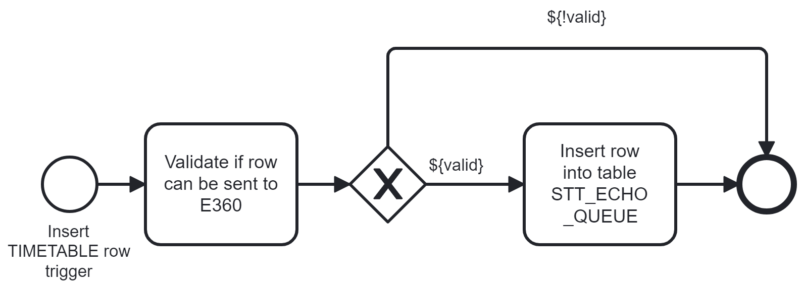
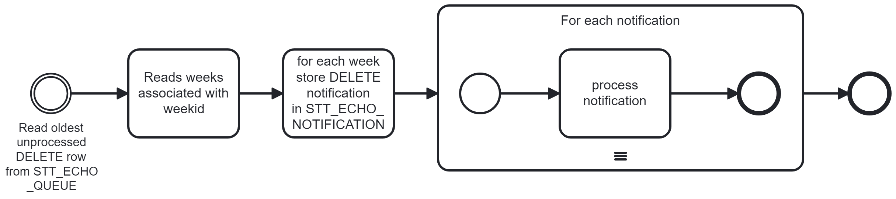
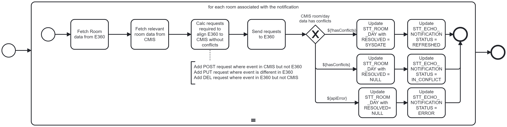

# CMIS Design


## Introduction

The purpose of this document is to describe a design to support the 
integration of Glasgow University's Timetabling system (CMIS) and their
audio and visual lesson recording system Echo360 (E360).

The integration will be one way, from CMIS to E360, 
and will include passing all timetable information for lessons that 
require video or audio recording and supporting information such as 
lecturer, course and room details. Where E360 is not aware of
supporting details, these details will submitted to E360 before
the timetable information.

The integration is complicated by the systems holding the data in different data structures and applying different constraints to determine what is valid data.

### Different constraints
The first challenge to integrating the 2 systems is that 
while the timetable is being developed within CMIS it is possible for it to be in an "invalid" state, such that it may record that 2 different lessons will be taught at the same time, in the same room by different lecturers and for different courses.

In contrast E360 has constraints that will not allow the timetable it holds to be in an "invalid" state. If an event is scheduled within E360 to be in a room at a certain date and time, and it is notified of another event taking place at the same date and time then it will reject the second notification. For the second notification to be accepted the original event must be updated to be in a different time or place or be deleted.

### Different data model structures
The second challenge to integrating the 2 systems is that the main table within the CMIS 
system has one row that represents a lesson taking place on 1 **or more weeks**.

In contrast, the main table within the E360 system has one row represent a lesson strictly on 1 week rather than on a set of weeks.

The impact of this is that one change within CMIS can result in multiple changes to E360 and due to the [different constraints](#Different constraints) some of these updates may be successful while others could fail.


## Integration Workflow
The integration from CMIS to E360 will be event driven.
The events will be initiated by insert, update and delete triggers that will be applied to CMIS's TIMETABLE table.
When the triggers are passed data that matches the [criteria for sending schedule information to E360](#Criteria for sending schedule information to E360) then a row will be written to the table STT_ECHO_QUEUE.
The work performed in the triggers will be kept to a minimum so as not to impact the overall
performance of CMIS.

A Java SpringFrameWork CRON process running in a new component SpaceTT2, will then read and process each of these rows in the order that they were written.

### Criteria for sending schedule information to E360

When a TIMETABLE entry is inserted, updated or deleted, it is only of interest to E360 if it meets the following criteria:
- the TIMETABLE column SOURCESID must have value 'TEACH'
- the TIMETABLE column STATUS must have value '2'
- the TIMETABLE column SLOTENTRY must have value '1'
- the TIMETABLE column ROOMID must be non-null
- a row must exist in MODULE table with the same (SETID, MODULEID)
- a row must exist in MODULEGROUPS with matching (SETID, MODULEID) and the first 2 chars of MODULEGROUPS.GRPCODE must match a row in STT_COMPONENT_TYPE.MODULE_SUBGROUP_CODE
- the MODULEGROUPS.GRPCODE value from above must have a length of 4 and characters 3 and 4 must be digits.
- a row must exist in ROOMREQUESTS with matching (SETID) and FEATUREID must have value 'AUDIOREC' or 'VIDEOREC'.
- a row must exist in ROOMFEATURES with matching (SETID, ROOMID) and FEATUREID must have value 'AUDIOREC' or 'VIDEOREC'.

Where the entry has been updated it is also only of interest to E360 if any of the values
relevant to E360 has been updated. If this is not the case then the update can be ignored.

<details>
<summary>Developer Note</summary>
The criteria above is an interpretation of the logic used the SpaceTT code `TestWorkloadExtractService#testProduceEchoExtract`.
</details>

### Processing Events from Insert Trigger
When the insert trigger on the TIMETABLE table is triggered the first thing it will do is assess whether the new row meets the criteria described above to allow it to be sent to E360.
If it does not meet the criteria then no further processing will be performed.
If it does meet the criteria then a row will be written to the table `STT_ECHO_QUEUE` with an ACTION type of INSERT.



### Processing Insert Events from STT_ECHO_QUEUE

Every minute a SpringFrameWork CRON job will initiate a java function to process new rows in STT_ECHO_QUEUE.
Where a new row has an ACTION type of INSERT the processing will be as shown below.


Due to the one-to-many relationship that can exist between the rows in the TIMETABLE table in CMIS and the 
REST API calls that need to be made to E360, the first step in this process is to identify the weeks that
this Insert transaction affects.
For each week an insert will be made into the table `STT_ECHO_NOTIFICATION` with an action of INSERT.
The process will then iterate over these weeks and attempt to update E360 to reflect the new state of CMIS.
In the vast majority of cases, the process will send a POST request to E360 and receive a 201 response indicating 
that the request was successfully processed. The java process will then update `STT_ECHO_NOTIFICATION` row
to reflect this by setting the STATUS to SUCCESS and updating the PROCESSED timestamp.
This scenario and the alternatives are described in the section [Process Notification](#Process Notification)

 
### Processing Events from Delete Trigger

When the delete trigger on the TIMETABLE table is triggered it has access to the old version of the row, i.e. the data that is being deleted.
It accesses whether the old version of the row met the criteria to allow it to be sent to E360.
If it did not then we can assume that E360 is not aware of the event and no further processing is required. If the data did meet the criteria then it will be inserted into the table `STT_ECHO_QUEUE`
with an ACTION type of DELETE.


### Processing Delete Events from STT_ECHO_QUEUE

Every minute a SpringFrameWork CRON job will initiate a java function to process new rows from STT_ECHO_QUEUE.
Where the new row has an ACTION type of DELETE the processing will be as shown below.



Due to the one-to-many relationship that can exist between the rows in the TIMETABLE table in CMIS and the
REST API calls that need to be made to E360, the first step in this process is to identify the weeks that
this Delete transaction affects.
For each week an insert will be made into the table `STT_ECHO_NOTIFICATION` with an action of DELETE.
The process will then iterate over these weeks and attempt to update E360 to reflect the new state of CMIS.

In the vast majority of cases, the process will send a DELETE request to E360 and receive a 200 response indicating
that the request was successfully processed. The java process will then update `STT_ECHO_NOTIFICATION`
to reflect this by setting the STATUS to SUCCESS and updating the PROCESSED timestamp.

It is possible due to a direct change made by a user on E360 or a previous refresh of a Room/Day, that the event
has already been deleted. In that case the value of `STT_ECHO_NOTIFICATION.STATUS` column will be set to WARN
and the message received from E360 stored in the MESSAGE column.

This scenario and the alternatives are described in the section [Process Notification]()

### Processing Events from Update Trigger

When the update trigger on the TIMETABLE table is triggered it has access to the new and old versions of the row.
It accesses whether the old and the new versions of the row meet the criteria to allow it to be sent to E360.
If both the old and the new versions do not meet the criteria then we can assume E360
is not currently aware of this event and does not need to become aware of it so
no further processing is required for this update, otherwise the details of the update will be inserted into the table `STT_ECHO_QUEUE` with an action type of UPDATE.


### Processing Update Events from STT_ECHO_QUEUE

Every minute a SpringFrameWork CRON job will initiate a java function to process new rows from STT_ECHO_QUEUE. Where the new row has an ACTION type of UPDATE the processing will be as shown below.


Due to the one-to-many relationship that can exist between the rows in the TIMETABLE table in CMIS and the REST API calls that need to be made to E360, the first step in this process is to identify how to process 
the update based on whether the previous and current versions of the row are eligible to be sent to E360.

If the previous version was not eligible but the new version is then the update can be treated in the same way as an insert, i.e. a row can be inserted into the STT_ECHO_NOTIFICATION table for each affected week with an ACTION type of INSERT.
If the previous version was eligible but the new version is not then the update can be treated in the same way as a Delete, i.e. a row can be inserted into the STT_ECHO_NOTIFICATION table for each affected week (based upon the WEEKID from the `:old` record) with an ACTION type of DELETE.
If the old and new versions are eligible and the WEEKID value has not changed then a row must be inserted into STT_ECHO_NOTIFICATION for each week affected with an ACTION type of UPDATE.
If the WEEKID value has changed then the old and new sets of weeks referenced by this row must be compared and a row must be inserted into the STT_ECHO_NOTIFICATION table for each of the weeks in the union of the old and new sets of weeks. 
The ACTION type will depend upon whether the week was in the old set but not the new (DELETE), the new set but not the old (INSERT), or in both the old and new sets (UPDATE).

The java process will then iterate over these rows in the STT_ECHO_NOTIFICATION table and where the ACTION type is INSERT or DELETE it will be processed as described in the sections above.
Where the ACTION type is UPDATE then the process will send an PUT request to E360 and receive a 200 response if the request was successfully processed. The java process will then update `STT_ECHO_NOTIFICATION`
to reflect this.

This scenario and the alternatives are described in the section [Process Notification]()


### Process Notification

When a row from STT_ECHO_NOTIFICATION is processed by the Java function, in the majority of cases an HTTP request object will be instantiated with an HTTP Method of POST/PUT/DELETE corresponding to the type of the insert/update/delete notification and posted to E360.
The response will generally be successful and the STT_ECHO_NOTIFICATION table columns PROCESSED will be updated with the current timestamp and STATUS will be updated with SUCCESS.

As discussed above it is possible for a different event to already exist in E360 in the target room at the same time.
In this situation E360 will respond with the error message `Venue / Time slot is already taken`.
The java process will then attempt to refresh all the CMIS data for that room and day
as described in [Refresh Room & Day Data](#Refresh Room & Day Data).

The first stage of processing a notification is to establish that the notification is not out of date.
It will be out of date if the last attempt to refresh the Room & Day data happened after the created timestamp on the notification. In this situation the notification's status will be updated to OUT_OF_DATE and no API calls will be made to E360. 

The process notification flow is shown in the diagram below.


Other error scenarios are described in the section [Error Handling](#Error Handling).


### Refresh Room & Day Data 

When the Java function attempts to schedule an event in E360 that overlaps with a different event's schedule then E360 will respond with the error `Venue / Time slot is already taken`.
We will then consider this Room & Day as being in-conflict and a row will be written to the table STT_ECHO_ROOM_DAY.

The java process will then attempt to reconcile the schedule within CMIS and E360 by:
1. fetching the events from E360 for that room on that day.
2. selecting from the CMIS TIMETABLE table the E360 relevant events on that day, excluding those events that are in conflict within the table.
3. calculating what requests will be required to make the schedule in E360 mirror that calculated in step 2.
4. send those requests to E360.
5. if no api errors occurred and no events were excluded in step 2 then update the row in STT_ECHO_NOTIFICATION with the status REFRESHED and insert a row into STT_ROOM_DATA with the RESOLVED column containing the current timestamp.
6. if no api errors occurred but events had to be excluded in 2. update the row in STT_ECHO_NOTIFICATION with the status IN_CONFLICT and insert a row into STT_ROOM_DATA with the RESOLVED column NULL.
7. if api errors occurred while sending the requests, record the errors in STT_ECHO_NOTIFICATION and insert a row into STT_ROOM_DATA with the RESOLVED column NULL.

This process is shown in the diagram below.



Where an update notification resulted in the conflict and the update involved a change in the room, then both the old and new rooms should be considered in conflict and therefore the refresh process will need to be run for each room.

Step 2 mentions that `relevant` events on that day will be retrieved from the CMIS TIMETABLE table.
Relevant can be interpreted differently depending upon the strategy for handling conflicts.
The 3 different strategies are:
1. Ignore events in conflict. This strategy requires that if events overlap then ignore them and only consider non-conflicting events as eligible for sending to E360.
2. First event wins. This strategy requires that where events overlap the event with the least recent update date would be considered as eligible for sending to E360.
3. Last event wins. This strategy requires that where events overlap the event with the most recent update date would be considered as eligible for sending to E360.

Strategies 2 and 3 may be more complex to implement because we could have a situation there is a chain of overlapping events e.g.

| id | room | start | end  |
|----|------|-------|------|
| 1  | 1    | 0900  | 1000 |
| 2  | 1    | 0930  | 1030 |
| 3  | 1    | 1000  | 1100 |

## Error Handling

When an error is received while processing a row within STT_ECHO_QUEUE
then an attempt will be made to recover, e.g. to fix missing reference data,
however if that is not possible then the STT_ECHO_QUEUE.STATUS value for that row will be set to `FAILED`
and a description of the error added to the STT_ECHO_QUEUE.ERROR column.

A UI will be created to allow administrators to view the messages that have failed
and allow them to retry 1 or more messages.
When the user submits a retry request via the UI then a new row(s) will be inserted into
STT_ECHO_QUEUE and these will be processed when a subsequent CRON job runs.

### Missing reference data

The reference data contained within E360 will be largely complete however we cannot rely upon all
the rooms, lecturers and sections (course + sub-group) and their parent entities being known to E360.


When a request to insert or update the schedule data in E360 fails because an entity
the schedule depends on is missing then SpaceTT2 will identify the type of
entity that is missing from the error response, insert the missing entity and any missing parent entities,
and then attempt to insert or update the schedule data again.

The approach may result in repeated attempts to insert or update the same schedule, for example,
when the room, lecturer and course information are all missing from E360.

#### Identifying missing reference data type

When E360 is unable to identify a particular entity specified in a schedule request then it will
return an error code of `400` and a JSON response document containing `RoomNotFound`, `UserNotFound` or
`ScheduleNotFound` respectively. An example response document for the room not found scenario
would be:
```json
{
  "error": "RoomNotFound",
  "message": "Room not found"
}
```

The parents of the Room and Section entities are shown in the diagram above.

NB Users/Lecturers cannot be created via the REST API and therefore will require manual intervention.

### External Id not unique
If an insert request is made but the external id is already known to Echo360 then we can assume that this request is
being retried and therefore if it fails on this occasion then we can assume it was successful previously and we can ignore the error.

### Venue / Time slot is already taken
When an insert or update request receives a `Schedule timing clash with another Schedule` error then record this error in
`STT_ECHO_QUEUE.ERROR` and do not resend until the issue has been resolved manually.

### Device not found in Room
```json
{"error":"JsonError","param":{"obj.venue.room":[{"msg":"Device not found in Room","args":[]}]}}
```

### Can a lecturer teach in 2 different rooms at the same time? YES
To investigate this I created 2 almost identical schedules, with only
the room and external ids being different as shown below:


This establishes that the same presenter can be assigned to
present in different rooms but at the same time.

### Other errors
When any other errors occur note them in `STT_ECHO_QUEUE.ERROR`
and await manual intervention before retrying.

===


Each update sent to E360 relies upon E360 being aware of the associated reference data, e.g. the course, room and lecturer data, and if E360 is not aware of this data then the request will fail. The failure message will indicate which piece of reference data is missing and the process will update E360 with this reference data before re-sending the initial request.

In the event that E360 already has a lesson scheduled for a particular room and date/time, E360 will respond with the error `Venue / Time slot is already taken`.
An attempt will now be made to refresh all scheduled events on this particular day in the room that has the clash.
If a conflict still exists then a row will then be inserted into the STT_ECHO_DAY_ROOM table.
When subsequent notifications are received for this room/day then a further full Room/Day refresh will take place, until the scheduling conflict is resolved.

### Handling inconsistent states in CMIS

Information will only be propagated from CMIS to E360 when the necessary data items have been entered, i.e.
the date, time, room, lecturer and course. While the timetable is being developed, timetablers can specify 
that a lesson will take place at the same time and place as another lesson. 
If we were to send details of both lessons to E360 then E360 would reject the latter. 
Subsequently if the former were to be rescheduled in CMIS to a different room, and we sent that update to E360,
how would CMIS know to re-send details of the lesson that was previously rejected.

There are many such scenarios where CMIS can move into and out of inconsistent states. 
Please see the [Scenarios page](./scenarios.md) for details.

This document will describe a strategy for handling these inconsistent states.

### No of rooms E360 is used in (23/24): 198
The following sql was used to identify all of the rooms with audio/visual equipment used for lectures in 2023/4

<details>
<summary>SQL</summary>

```sql
select 
    roomid, roomgrpcode, count(*)
from (
    select t.roomid, t.roomgrpcode, (ws.startdate + t.weekday), t.starttime, t.finishtime, t.lecturerid, p.BUSINESSEMAIL, t.moduleid, t.modgrpcode, rr.itemnum, rr.featureid 
    from timetable t 
        inner join weekmapnumeric wmn on wmn.setid = t.setid and wmn.weekid = t.weekid
        inner join weekstructure ws on ws.setid = wmn.setid and ws.weeknumber = wmn.weeknumber
        left outer join stt_ext_person p on p.personno = t.lecturerid
        left outer join roomrequests rr on rr.setid = t.setid and rr.slotid = t.slotid and rr.slotentry = t.slotentry
    where t.setid = '2023/24' and t.slotentry = 1 and t.status = 2 and t.sourcesid = 'TEACH' and roomid is not null and rr.featureid in ('AUDIOREC', 'VIDEOREC')
    order by t.roomid, ws.startdate, t.weekday, t.starttime
) tt
group by roomid, roomgrpcode
order by 3 desc, 1, 2;
```
</details>

The most used room was 203 Lec Theatre 1, Boyd Orr (ID=2950203) that was used 766 times.

There are 198 rooms with audio/visual equipment.


## Component Interactions


## DB Table STT_ECHO_QUEUE
To support the integration with E360 a new table will be created.

| SOURCE         | NAME          | TYPE          | DESC                                                |
|----------------|---------------|---------------|-----------------------------------------------------|
| TIMETABLE      | ID            | NUMBER        | Sequence SEQ_STT_ECHO_QUEUE                         |
| TIMETABLE      | OLD_VALID     | BOOLEAN       | Calc from OLD values passed to trigger              |
| TIMETABLE      | NEW_VALID     | BOOLEAN       | Calc from NEW values passed to trigger              |
|                | CREATED       | DATE          | Date/timestamp when row was inserted                |
|                | PROCESSED     | DATE          | Date/timestamp when row was processed               |
|                | STATUS        | VARCHAR(1)    | [UNPROCESSED \| IN_PROGRESS \| PROCESSED \| FAILED] |
|                | ERROR         | VARCHAR2(100) | A description of the error                          |
| TIMETABLE      | ACTION        | VARCHAR(1)    | The type of request to be sent to E360: [I\|U\|D]   |
| TIMETABLE      | SETID         | VARCHAR2(10)  |                                                     |
| TIMETABLE      | SLOTID        | NUMBER        |                                                     |
| TIMETABLE      | WEEKID_OLD    | NUMBER        |                                                     |
| TIMETABLE      | WEEKID_NEW    | NUMBER        |                                                     |
| TIMETABLE      | WEEKDAY       | NUMBER        |                                                     |
| TIMETABLE      | STARTTIME     | VARCHAR2(5)   |                                                     |
| TIMETABLE      | FINISHTIME    | VARCHAR2(5)   |                                                     |
| TIMETABLE      | MODULEID      | VARCHAR2(20)  |                                                     |
| TIMETABLE      | MODGRPCODE    | VARCHAR2(10)  |                                                     |
| TIMETABLE      | ROOMID        | VARCHAR2(16)  |                                                     |
| TIMETABLE      | ROOMGRPCODE   | VARCHAR2(12)  |                                                     |
| TIMETABLE      | LECTURERID    | VARCHAR2(10)  |                                                     |
| STT_EXT_PERSON | BUSINESSEMAIL | VARCHAR2(80)  | TODO replace lookup in STT table with a CMIS table  |
| ROOMREQUESTS   | FEATUREID     | VARCHAR2(10)  |                                                     |

NB We don't need the slot entry because it is always 1.


## DB Table STT_ECHO_DAY_ROOM
To support the integration with E360 a new table will be created.

| SOURCE         | NAME        | TYPE          | DESC                                                |
|----------------|-------------|---------------|-----------------------------------------------------|
| TIMETABLE      | ID          | NUMBER        | Sequence SEQ_STT_ECHO_QUEUE                         |
|                | CREATED     | DATE          | Date/timestamp when row was inserted                |
|                | RESOLVED    | DATE          | Date/timestamp when row was processed               |
| TIMETABLE      | LESSON_DATE | VARCHAR2(16)  |                                                     |
| TIMETABLE      | ROOMID      | VARCHAR2(16)  |                                                     |
| TIMETABLE      | ROOMGRPCODE | VARCHAR2(12)  |                                                     |


## DB Table STT_ECHO_NOTIFICATION
 To support the integration with E360 a new table will be created.

| SOURCE         | NAME          | TYPE          | DESC                                                |
|----------------|---------------|---------------|-----------------------------------------------------|
| TIMETABLE      | ID            | NUMBER        | Sequence SEQ_STT_ECHO_QUEUE                         |
| TIMETABLE      | OLD_VALID     | BOOLEAN       | Calc from OLD values passed to trigger              |
| TIMETABLE      | NEW_VALID     | BOOLEAN       | Calc from NEW values passed to trigger              |
|                | CREATED       | DATE          | Date/timestamp when row was inserted                |
|                | PROCESSED     | DATE          | Date/timestamp when row was processed               |
|                | STATUS        | VARCHAR(1)    | [UNPROCESSED \| IN_PROGRESS \| PROCESSED \| FAILED] |
|                | MESSAGE       | VARCHAR2(100) | A description of the error/warning                  |
| TIMETABLE      | ACTION        | VARCHAR(1)    | The type of request to be sent to E360: [I\|U\|D]   |
| TIMETABLE      | SETID         | VARCHAR2(10)  |                                                     |
| TIMETABLE      | SLOTID        | NUMBER        |                                                     |
| TIMETABLE      | WEEKID_OLD    | NUMBER        |                                                     |
| TIMETABLE      | WEEKID_NEW    | NUMBER        |                                                     |
| TIMETABLE      | WEEKDAY_OLD   | NUMBER        |                                                     |
| TIMETABLE      | WEEKDAY_NEW   | NUMBER        |                                                     |
| TIMETABLE      | STARTTIME     | VARCHAR2(5)   |                                                     |
| TIMETABLE      | FINISHTIME    | VARCHAR2(5)   |                                                     |
| TIMETABLE      | MODULEID      | VARCHAR2(20)  |                                                     |
| TIMETABLE      | MODGRPCODE    | VARCHAR2(10)  |                                                     |
| TIMETABLE      | ROOMID        | VARCHAR2(16)  |                                                     |
| TIMETABLE      | ROOMGRPCODE   | VARCHAR2(12)  |                                                     |
| TIMETABLE      | LECTURERID    | VARCHAR2(10)  |                                                     |
| STT_EXT_PERSON | BUSINESSEMAIL | VARCHAR2(80)  | TODO replace lookup in STT table with a CMIS table  |
| ROOMREQUESTS   | FEATUREID     | VARCHAR2(10)  |                                                     |

NB We don't need the slot entry because it is always 1.


## Spring CRON job

A new application will be created called SpaceTT2.
This application will run on Java21 which is the latest LTS Java version.
This application will be configured to run Spring CRON jobs.
The library that will be used to provide the CRON functionality will be the [Quartz Scheduler](https://docs.spring.io/spring-boot/reference/io/quartz.html).
This library can be easily configured to ensure that CRON jobs only run on one server at a time
should WildFly ever be configured to use multiple servers.

The CRON job will initiate a call to the E360Servce component that will
process messages waiting to be processed on the STT_E360_QUEUE.

## E360Service

The E360Service will read all unprocessed messages from the STT_E360_QUEUE table.
For each row a request will be created and posted to the E360 REST service.

All of the data that needs to be sent to E360 in the Schedule message is contained in the STT_E360_QUEUE table.

Examples of each of the request types are shown below.

### E360 Insert Request

An example of an Echo360 request to notify it of a new timetable entry is shown below:

```json
{
  "startDate": "2024-11-15",
  "startTime": "15:00",
  "endTime": "16:00",
  "sections": [
    {
      "sectionExternalId": "ENGLANG1003_LC01"
    }
  ],
  "name": "Test New Schedule Name",
  "externalId": "617747-1-2023-24",
  "venue": {
    "roomExternalId": "ROOM1"
  },
  "presenter": {
    "userEmail": "David.J.Forrest@glasgow.ac.uk"
  },
  "input1": "Display",
  "input2": "Video",
  "captureQuality": "High"
}
```

TODO where does captureQuality come from?

An example of a response to a successful create event looks as shown below:
```json
{
  "institutionId": "53a8f99c-fb41-4139-9c3c-c471c49f8cf7",
  "id": "43884be2-4906-4bd6-b626-aa0e2f4e2013",
  "name": "Test New Schedule Name",
  "startDate": "2024-11-15",
  "startTime": "15:00",
  "endTime": "16:00",
  "venue": {
    "campusId": "5287b36c-3675-4589-9917-d7173077fbef",
    "campusName": "GILMOREHILL CAMPUS",
    "buildingId": "8479ac03-735f-4982-bdb8-3617978bfd00",
    "buildingName": "Test",
    "roomId": "d73fa127-9cd5-44f9-9cfa-d2445dcafd23",
    "roomName": "Main Meeting Room"
  },
  "presenter": {
    "userId": "14590435-35ff-4650-adf2-796c0e612ad0",
    "userEmail": "David.J.Forrest@glasgow.ac.uk",
    "userFullName": "David Forrest"
  },
  "sections": [
    {
      "courseId": "66567d3e-b575-43cc-ba1a-4f4510bbbb72",
      "courseIdentifier": "ENGLANG1003",
      "termId": "ac00a9be-15f9-4f84-a85e-f9edf50ea38d",
      "termName": "2020/21",
      "sectionId": "8b2437e9-3639-4f9f-9683-c7c869bd187e",
      "sectionName": "LC01"
    }
  ],
  "shouldCaption": false,
  "shouldStreamLive": false,
  "shouldAutoPublish": true,
  "shouldRecurCapture": false,
  "input1": "Display",
  "input2": "Video",
  "captureQuality": "High",
  "externalId": "617747-1-2023-24"
}
```

The full schema for the operation `Add Schedule` is available from the [API documentation](https://echo360.org.uk/api-documentation#!/schedules_v2/Create).

### E360 Update Request

An example of updating the time is shown below.

```json
{
   "startDate": "2024-11-15",
   "startTime": "16:00",
   "endTime": "17:00",
   "sections": [
      {
         "sectionExternalId": "ENGLANG1003_LC01"
      }
   ],
   "name": "Test New Schedule Name",
   "externalId": "617747-1-2023-24",
   "venue": {
     "roomExternalId": "ROOM1"
   },
   "presenter": {
      "userEmail": "David.J.Forrest@glasgow.ac.uk"
   },
   "input1": "Display",
   "input2": "Video",
   "captureQuality": "High"
}
```

The response to an update request is structurally the same as for an insert request.

### E360 Delete Request

An example of a request that can be sent to delete an event is shown below:
```json
delete /public/api/v2/schedules/{schedule}
```
where {schedule} can be an external id or an E360 id. We shall use the external id.

## User Interface

A user interface will be available to allow administrators to view the number of schedules that have been
transferred in the last 24 hours and the number (if any) that are pending transfer.

Administrators will also be able to see the schedules that failed to transfer 
and re-trigger the sending of the schedule change.

## Tasks to integrate CMIS with ECHO360

- Setup Wildfly server running Java 21 in the TEST and LIVE environments
- Create a template project running Java 21
- Create the table STT_ECHO_QUEUE.
- Create Stored Procedures to write to STT_ECHO_QUEUE.
- Create the new DB triggers on the TIMETABLE table.
- Add new CRON job to process files to E360
- Add E360Service method to read messages from STT_ECHO_QUEUE
- Add E360Service method to send messages to E360 REST API
- Add error handling code for when the following entities are missing:
  - Room, Building
  - Section, Course, Department, Organisation
- Add UI page to allow administrators to view messages that failed with their error messages.
- Add UI page to allow administrators to retry one or more messages to be retried
- Add UI page to allow administrators to pause the sending of messages to E360

## Definitions

Lesson
: An event where a specified lecturer presents part of a course in a particular room at certain date and time.

E360
: The GU Echo360 server that captures and makes available video and audio recordings.

SpaceTT2
: A new component that may be implemented by GU IT department to automate the integration between CMIS and Echo360.

## TODO
1. verify that where a timetable entry with entryslot <> 1 that it will not have an impact on integration
2. could we update every minute in the expectation that few clashes will occur and repair clashes over-night with batch?
3. when will E360 report a clash? 
4. send emails to users with clashing events
5. Run process in batch mode to update all rooms for the whole year.
6. admin screen to view errors
7. admin screen to run batch mode for selected rooms/all rooms

